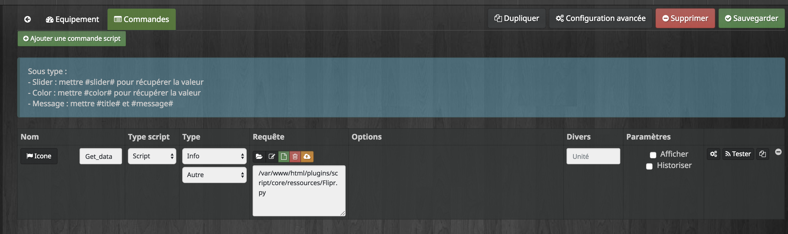
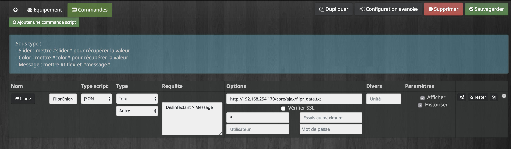

FLIPR swimming pool domotic controler. 

The python script can be used for Jeedom in order to retrieve Flipr information from their API.

Script Object to retrieve information from Flipr API

&nbsp;&nbsp;

Script Object to retrieve information from Chlorine

&nbsp;&nbsp;